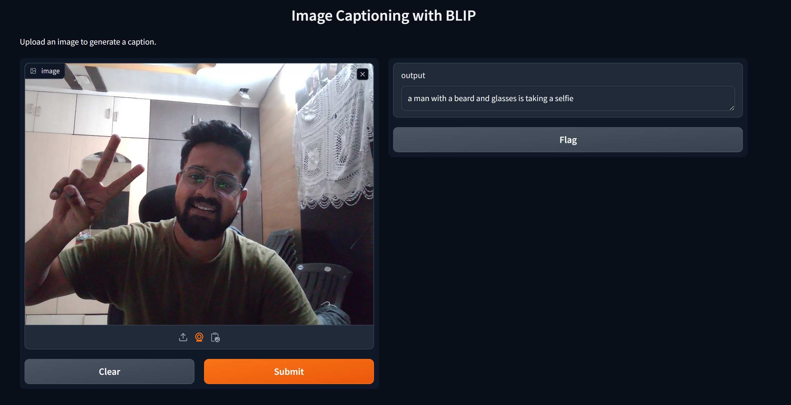

# Image Captioning with BLIP and Gradio

## Project Overview

This project demonstrates an innovative use of the **BLIP (Bootstrapped Language Image Pre-training)** model for image captioning, combined with an interactive **Gradio interface**. The BLIP model generates descriptive captions for images, which can assist in:

- Supporting **visually impaired individuals** by describing images.
- Enhancing **photo organization** and **searchability** for large image libraries.

The **Gradio interface** makes this tool accessible to non-technical users, such as photographers or digital asset managers, enabling them to upload images and receive captions effortlessly.

---

## How It Works

This project integrates the BLIP model from the `transformers` library with Gradio for a seamless user experience. Key steps include:

1. **Image Processing**:
   - The BLIP processor converts uploaded images into inputs for the model.
2. **Caption Generation**:
   - A function generates and displays captions for each uploaded image.
3. **Gradio Interface**:
   - Users interact with the application through a simple web-based interface, where they upload images and receive captions instantly.

Below is a screenshot of the interface:



---

## Code Overview

### Key Components:
1. **BLIP Processor and Model**:
   - Initializes the processor and model for caption generation.
2. **Caption Logic**:
   - `generate_caption()` handles input processing and generates captions.
   - `caption_image()` wraps the logic to handle errors.
3. **Gradio Integration**:
   - `gr.Interface()` sets up the user-friendly interface for image uploads.

---

## Usage Instructions

### Prerequisites:
- **Python 3.x**
- Install dependencies with:
  ```bash
  pip install gradio transformers Pillow
